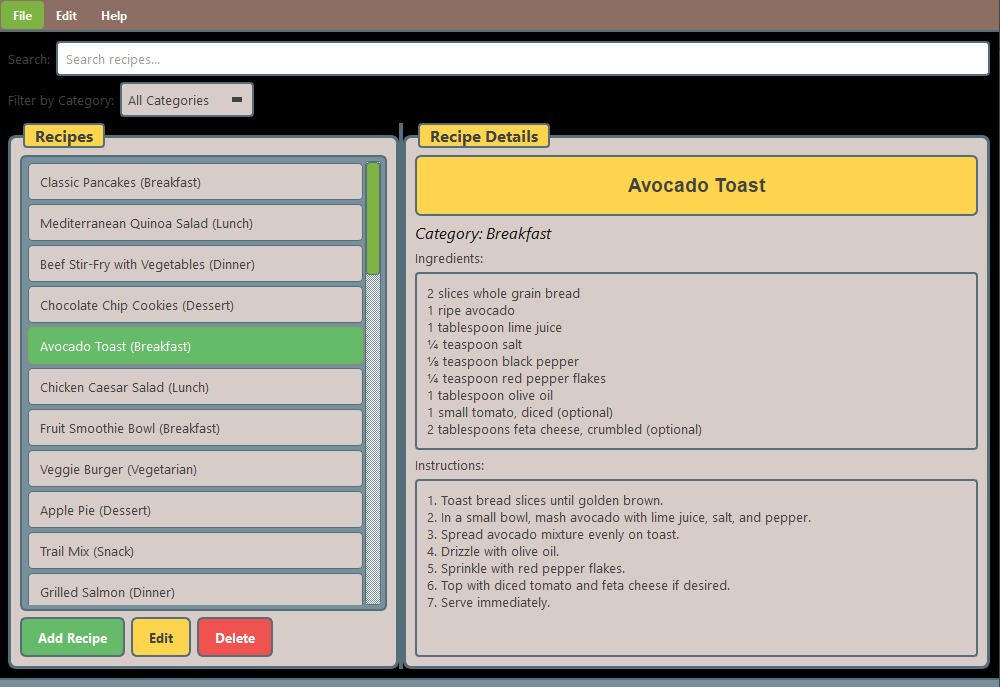

# 🧠 Smart Recipe Planner


*A Minecraft-themed, Python + PyQt6 desktop application for managing recipes, ingredients, and meal planning.*

> **Educational Project**: Developed as part of a programming course to demonstrate UI design, modular architecture, and real-world development workflows.

---

## 📌 Table of Contents

- [Overview](#overview)
- [Features](#features)
- [Installation](#installation)
- [Getting Started](#getting-started)
- [Usage](#usage)
  - [Managing Recipes](#managing-recipes)
  - [Ingredients Management](#ingredients-management)
  - [Meal Planning](#meal-planning)
- [Architecture](#architecture)
- [Customization](#customization)
- [Troubleshooting](#troubleshooting)
- [License](#license)
- [Educational Context](#educational-context)

---

## Overview

**Smart Recipe Planner** is a user-friendly desktop app to organize your recipes and plan meals—featuring a **Minecraft-inspired interface** with blocky aesthetics and earthy colors. Built with Python and PyQt6, it offers an intuitive experience for home cooks and programming learners alike.

---

## Features

### ✅ Core Functionality

- **Recipe Management**: Add, edit, delete recipes with detailed info
- **Category Filtering**: Breakfast, Lunch, Dinner, Vegan, etc.
- **Search Recipes**: By name or ingredients
- **Dual-Pane UI**: List view + detailed view

### 🍽 Ingredients & Planning

- Ingredient tracking with units
- Weekly/monthly meal planner (drag & drop)
- Balanced category-based planning

### 🎮 Theming & UI



- Minecraft-style theme: blocky, pixel-like visuals
- Keyboard shortcuts: Ctrl+A (Add), Ctrl+Q (Quit), etc.
- Responsive layout via PyQt6

### 💾 Data Handling

- JSON storage for easy portability
- Modular architecture for easy maintenance

---

## Installation

### Prerequisites

- Python 3.7+
- PyQt6

### Setup

```bash
# Clone the repository
git clone https://github.com/yourusername/smart-recipe-planner.git
cd smart-recipe-planner

# Install dependencies
pip install PyQt6

# Run the app
python main.py
```

---

## Getting Started

1. Launch the application  
2. Click **Add Recipe** (or press `Ctrl+A`)  
3. Enter details:  
   - Recipe Name  
   - Category  
   - Ingredients  
   - Instructions  
4. Save and organize recipes by category  
5. Start planning meals!

---

## Usage

### Managing Recipes

#### ➕ Adding

- Click **Add Recipe** or press `Ctrl+A`
- Fill out the following fields:
  - **Name**
  - **Category** (select existing or create new)
  - **Ingredients** (one per line)
  - **Instructions**
- Click **Save**

#### ✏️ Editing

- Select a recipe
- Click **Edit**
- Update the details
- Click **Save**

#### ❌ Deleting

- Select a recipe
- Click **Delete**
- Confirm deletion

---

### 🔍 Searching & Filtering

- Use the **search box** to find recipes by name or ingredients  
- Use the **category dropdown** to filter  
- Combine search + filter for precise results

---

### Ingredients Management

- Add ingredients with quantities and units  
- Organize ingredients by type or category  
- View ingredients in the detailed recipe panel  

---

### Meal Planning

1. Open the **Meal Planner** tab  
2. Choose a view: **week** or **month**  
3. Drag recipes onto calendar days  
4. Plan meals across different categories  
5. Track meals across days

---

## Architecture

### 📁 File Structure

```bash
recipeManager/
   ├── main.py                   # Entry point
   ├── data/
   │ └── recipes.json            # Stored recipe data
   └── src/
      ├── main_window.py         # UI layout & controls
      ├── recipe_manager.py      # Data operations
      ├── recipe_dialog.py       # Add/edit form
      ├── custom_signals.py      # PyQt signal management
      └── styles.py              # Theme styles
```

---

## Customization

### Modify Theme

- Open `src/styles.py`
- Update the `MINECRAFT_COLORS` dictionary
- Adjust style rules for various widgets

### Add New Categories

- Use the **Add/Edit** dialog in the application  
- Or update category logic in `recipe_manager.py`

### Extend the App

- Add new signals in `custom_signals.py`
- Expand logic in `recipe_manager.py`
- Add UI components in `main_window.py`

---

## Troubleshooting

| Issue                    | Solution                                                  |
|--------------------------|-----------------------------------------------------------|
| App won't start          | Ensure PyQt6 is installed and Python version is ≥ 3.7     |
| Recipes not saving       | Make sure `data/recipes.json` exists and is writable      |
| UI broken or theme issue | Check if your PyQt6 version supports all style features   |

---

## License

This project is licensed under the MIT License.

```text
MIT License 

Copyright (c) 2024 Melissa Louise Bangloy

Permission is hereby granted, free of charge, to any person obtaining a copy
of this software and associated documentation files (the "Software"), to deal
in the Software without restriction, including without limitation the rights
to use, copy, modify, merge, publish, distribute, sublicense, and/or sell
copies of the Software, and to permit persons to whom the Software is
furnished to do so, subject to the following conditions:

The above copyright notice and this permission notice shall be included in all
copies or substantial portions of the Software.

THE SOFTWARE IS PROVIDED "AS IS", WITHOUT WARRANTY OF ANY KIND, EXPRESS OR
IMPLIED, INCLUDING BUT NOT LIMITED TO THE WARRANTIES OF MERCHANTABILITY,
FITNESS FOR A PARTICULAR PURPOSE AND NONINFRINGEMENT. IN NO EVENT SHALL THE
AUTHORS OR COPYRIGHT HOLDERS BE LIABLE FOR ANY CLAIM, DAMAGES OR OTHER
LIABILITY, WHETHER IN AN ACTION OF CONTRACT, TORT OR OTHERWISE, ARISING FROM,
OUT OF OR IN CONNECTION WITH THE SOFTWARE OR THE USE OR OTHER DEALINGS IN THE
SOFTWARE.
```

## Educational Context

This application was developed as part of an academic project to demonstrate core software development principles and practical GUI application design.

### 🛠️ Skills Demonstrated

- GUI programming using **PyQt6**
- JSON-based data persistence
- Modular and extensible Python architecture
- Themed UX/UI design
- Event-driven programming with **signals and slots**

---

### 🧠 Learning Objectives

Students and contributors working on this project will learn to:

- Build desktop GUI applications with PyQt6
- Design and implement modular systems for maintainability
- Manage and persist user data using JSON
- Create cohesive UI themes and user experiences
- Apply object-oriented programming principles in real applications