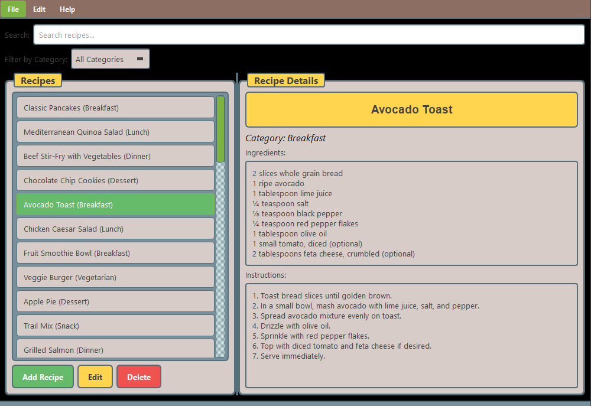

# Smart Recipe Planner

*A Minecraft-themed, Python + PyQt6 desktop application for managing recipes, ingredients, and meal planning.*

> **Educational Project**: Developed as part of a programming course to demonstrate UI design, modular architecture, and real-world development workflows.

---

## Overview

**Smart Recipe Planner** is a user-friendly desktop app to organize your recipes and plan meals—featuring a **Minecraft-inspired interface** with blocky aesthetics and earthy colors. Built with Python and PyQt6, it offers an intuitive experience for home cooks and programming learners alike.

---

## Features

### Core Functionality

- **Recipe Management**: Add, edit, delete recipes with detailed info
- **Category Filtering**: Breakfast, Lunch, Dinner, Vegan, etc.
- **Search Recipes**: By name or ingredients
- **Dual-Pane UI**: List view + detailed view

### 🍽 Ingredients & Planning

- Ingredient tracking with units
- Weekly/monthly meal planner (drag & drop)
- Balanced category-based planning

### Theming & UI



- Minecraft-style theme: blocky, pixel-like visuals
- Keyboard shortcuts: Ctrl+A (Add), Ctrl+Q (Quit), etc.
- Responsive layout via PyQt6

### 💾 Data Handling

- JSON storage for easy portability
- Modular architecture for easy maintenance

---

## Installation

### Prerequisites

- Python 3.7+
- PyQt6

### Setup

```bash
# Clone the repository
git clone https://github.com/melissa0987/recipeManager
cd recipeManager/

# Install dependencies
pip install PyQt6

# Run the app
python main.py
```

---

## Getting Started

1. Launch the application  
2. Click **Add Recipe** (or press `Ctrl+A`)  
3. Enter details:  
   - Recipe Name  
   - Category  
   - Ingredients  
   - Instructions  
4. Save and organize recipes by category  
5. Start planning meals!

---

## Usage

### Managing Recipes

#### Adding

- Click **Add Recipe** or press `Ctrl+A`
- Fill out the following fields:
  - **Name**
  - **Category** (select existing or create new)
  - **Ingredients** (one per line)
  - **Instructions**
- Click **Save**

#### Editing

- Select a recipe
- Click **Edit**
- Update the details
- Click **Save**

#### Deleting

- Select a recipe
- Click **Delete**
- Confirm deletion

---

### Searching & Filtering

- Use the **search box** to find recipes by name or ingredients  
- Use the **category dropdown** to filter  
- Combine search + filter for precise results

---

### Ingredients Management

- Add ingredients with quantities and units  
- Organize ingredients by type or category  
- View ingredients in the detailed recipe panel  

---

### Meal Planning

1. Open the **Meal Planner** tab  
2. Choose a view: **week** or **month**  
3. Drag recipes onto calendar days  
4. Plan meals across different categories  
5. Track meals across days

---

## Architecture

### File Structure

```bash
recipeManager/
   ├── main.py                   # Entry point
   ├── data/
   │ └── recipes.json            # Stored recipe data
   └── src/
      ├── main_window.py         # UI layout & controls
      ├── recipe_manager.py      # Data operations
      ├── recipe_dialog.py       # Add/edit form
      ├── custom_signals.py      # PyQt signal management
      └── styles.py              # Theme styles
```

---


## License
his project is developed for educational purposes as part of a Application Development (DESKTOP) course project.
> **Educational Project**: Developed as part of a programming course to demonstrate UI design, modular architecture, and real-world development workflows.


### Skills Demonstrated

- GUI programming using **PyQt6**
- JSON-based data persistence
- Modular and extensible Python architecture
- Themed UX/UI design
- Event-driven programming with **signals and slots**

